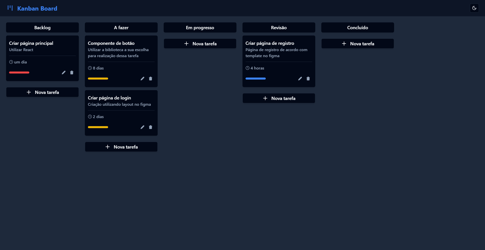

# REACT KANBAN BOARD


> Painel Kanban com React

<div style="width:100%; display:flex; align-items:center; gap:16px">

</div>


## Detalhes do aplicativo

- O projeto consiste num painel kanban simples com opções de arrastar e soltar cartões, criação, edição e remoção de tarefas, além de alteração de tema (claro e escuro).


## 🚀 Melhorias implementadas
- [x] - Funcionalidade arrasta e solta (drag & drop) com React Beautiful DnD
- [x] - Estilização com Tailwind CSS
- [x] - Biblioteca de icones Lucide React
- [x] - Biblioteca de componentes Shadcn/ui
- [x] - Manipulação de estado com Redux
- [x] - Armazenamento em local storage
- [x] - Roteamento com React Router


## 💻 Como usar o projeto
Para gerar uma cópia do projeto e implementar as suas melhorias, esteja em um computador com Node Js instalado e siga as etapas abaixo:

1  clone o projeto com o comando 
```
git clone https://github.com/devggui/react-kanban-board
``` 
2  Acesse o projeto pelo terminal com o comando 
```
cd react-kanban-board
```  
3  Instale as dependências necessárias com o comando
```
npm install
```
4  Rode o projeto com o comando
```
npm run dev
``` 
5  Ou acesse o aplicativo através do website [React Kanban Board](https://react-kanban-board.vercel.app) 


## 🌐 Links úteis
[NodeJS](https://nodejs.org/en/download)  
[ReactJS](https://react.dev)  
[Vite](https://vitejs.dev)  
[Tailwind CSS](https://tailwindcss.com)  
[Lucide](https://lucide.dev)  
[Shadcn/ui](https://ui.shadcn.com)  
[Redux](https://redux.js.org)  
[React Beautiful DnD](https://github.com/atlassian/react-beautiful-dnd)  
[React Router](https://reactrouter.com/en/main)  


## 🧑‍💻 Guilherme Henrique

[](https://www.linkedin.com/in/devggui)
[](https://gthub.com/devggui)
[](http://wa.me/5514998619263)
[](https://devggui.netlify.app)